# Zero Shot - Self Suspervised Learning MRI Reconstruction

Unrolled data-consistency with a learned 2.5D prior (Pseudo3DUNet). Baselines use CG-SENSE.

---

## Repo layout
- `models/` — checkpoints (`best_prior.pt`, `best_cued_prior.pt`)  
- `results/` — figures & GIFs used in this README  
- `/` — data prep, train notebooks

---

## Data (what we load)
- `ksp: (P, C, X, Y, Z) complex64`, `sens: (C, X, Y, Z) complex64`  
- Masks `theta/lam/val/omega: (P, Y, Z)` → broadcast as `(P,1,1,Y,Z)`  
- Temporal cues `cues_2d: (P, 2, Y, Z)` (phase-sin, phase-cos)

---

## Model & training
- **Prior**: Pseudo3DUNet2p5D (2K real/imag channels of neighboring slices → 2-ch residual).  
- **Temporal cue**: +2 channels (sin, cos) concatenated to input.  
- **Unrolled DC**: CG step with forward/adjoint SENSE.  
- **Loss (k-space)**: Λ = L1 + L2.  
- **Schedulers**: warm-start + cosine anneal LR; cosine λ schedule.

---

## Results

### A) Side-by-side mid-slice panels (CG | ZS-SSL | ZS-SSL + cue)

  <em>Phase 04 — slice 40</em> 
  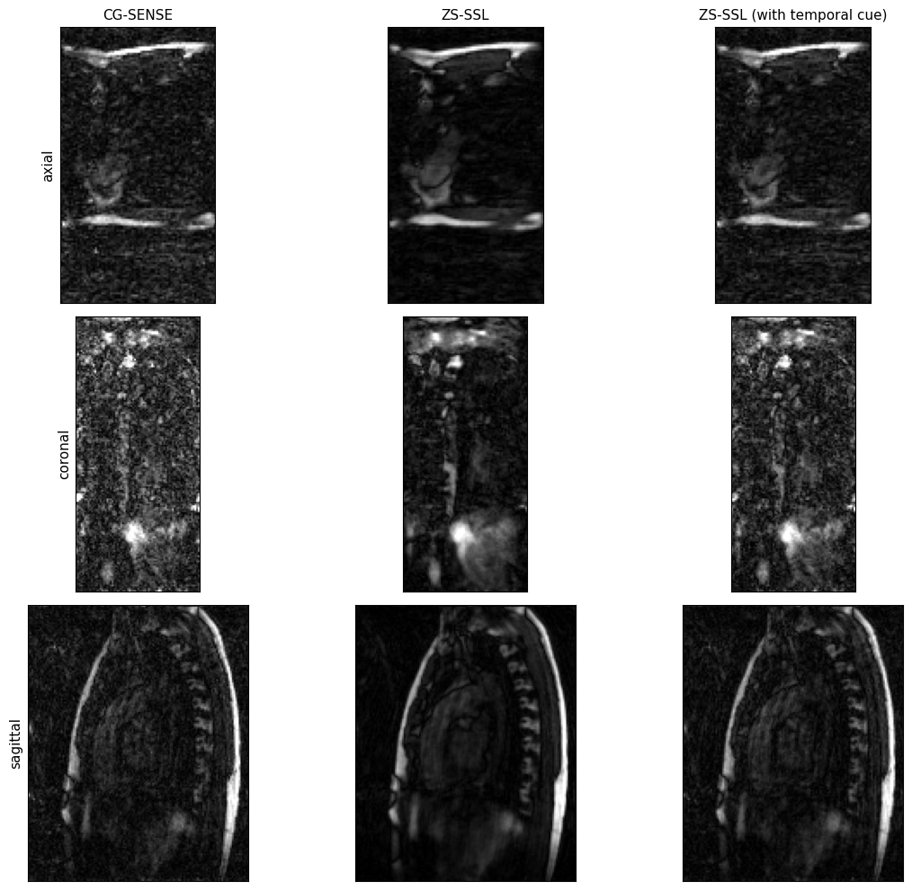
    
  <em>Phase 17 — slice 52</em> 
  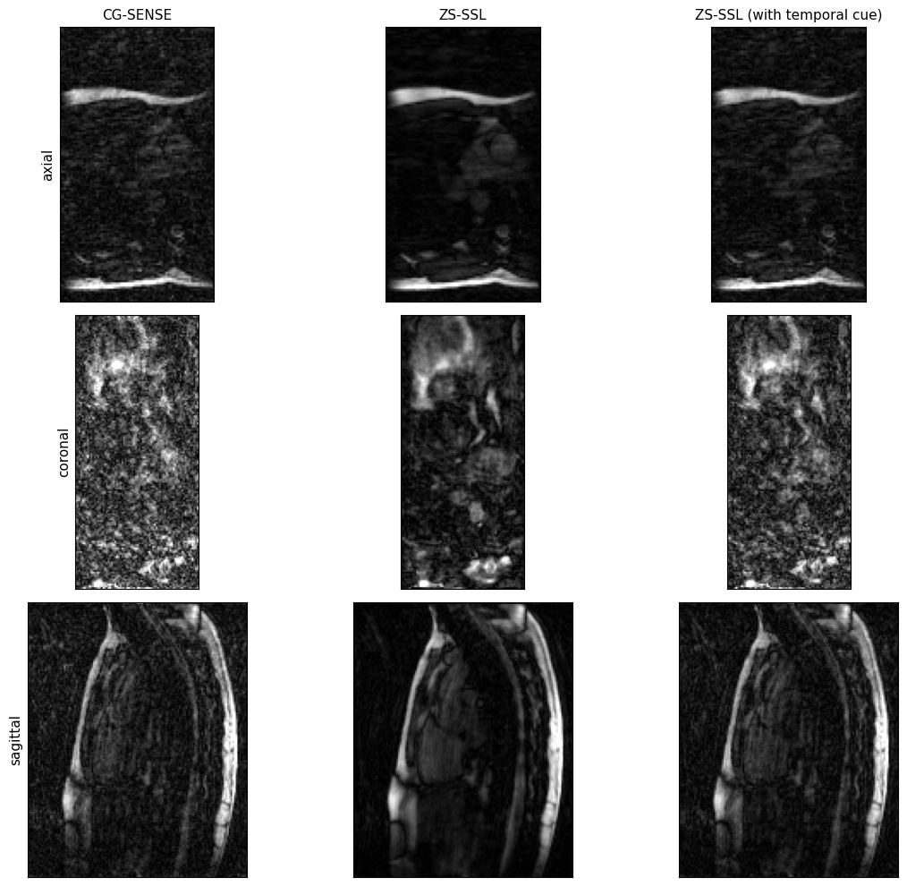
      
  <em>Phase 04 — mid slice</em> 
  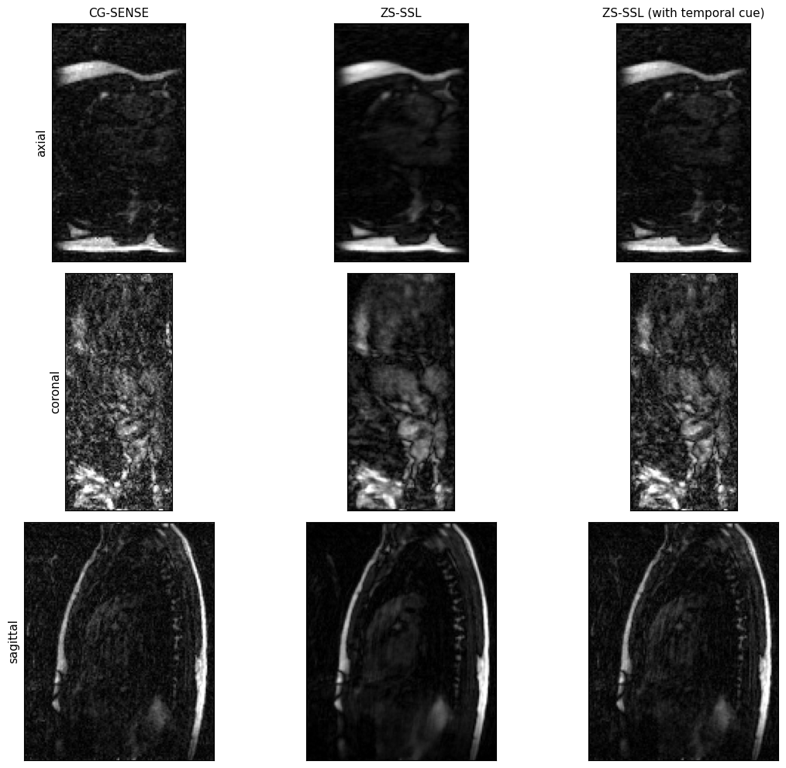
      
  <em>Phase 10 — slice 50</em> 
  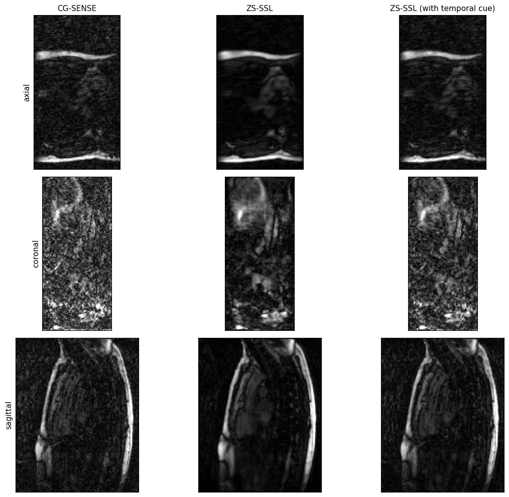

*File expectations:*  
`results/p04_axial_panel.png`, `results/p17_axial_panel.png`  
(Each panel is a horizontal triptych: CG | no-cue | cue.)

---

### B) Intensity histograms (baseline vs ZS-SSL)

  <em>Phase 04 — Sagittal - Mid Slice</em> 
  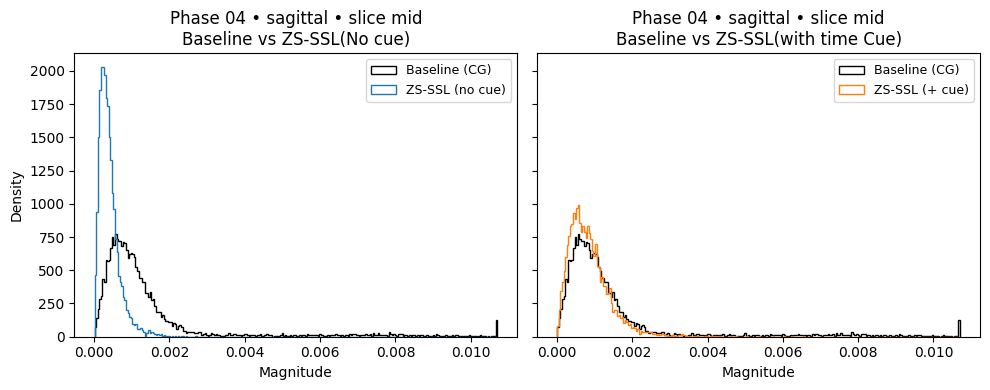
    
  <em>Phase 17 — Sagittal - Slice 30</em> 
  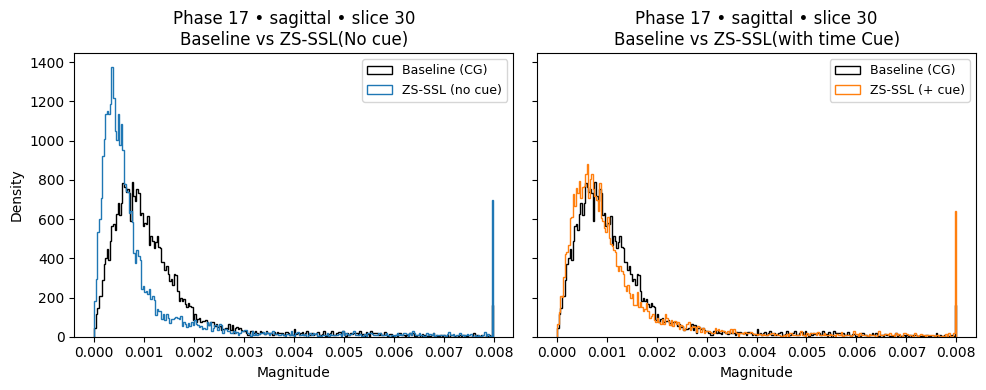

Reports: mean/std per volume and Jensen–Shannon divergence (JS).

---

### C) k-space heatmaps (2D FFT magnitude of a slice)

  <em>Phase 04 — axial - mid-slice</em> 
  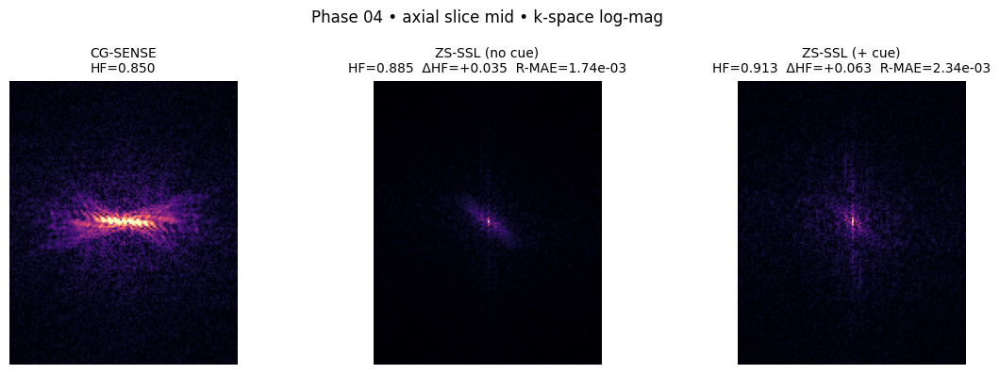
    
  <em>Phase 17 — axial - slice-60</em> 
  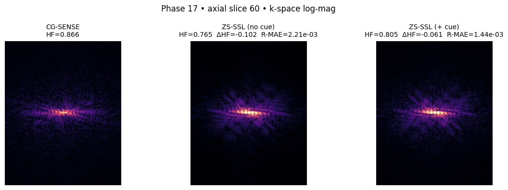

Reported alongside:  
- High-frequency energy (sum over outer ring),  
- Radial profile MAE,  
- Data-consistency MSE (Ω_MSE),  
- Unacquired-region energy (Ωᶜ_E).

---

### D) GIFs (per-view slice stacks)
**Per-phase (all slices in one phase, triptych per frame):**

  <em>Phase 04 — axial</em> 
  
   
  <em>Phase 04 — coronal</em> 
  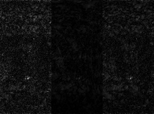
   
  <em>Phase 04 — sagittal</em> 
  

**Per-slice across phases (fix slice index, triptych per frame):**

  <em>Phase 10 - Slice z=mid across phases — axial</em> 
  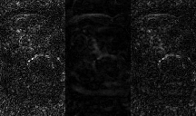
   
  <em>Phase 10 - Slice z=mid across phases — coronal</em> 
  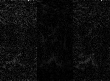
   
  <em>Phase 10 - Slice z=mid across phases — sagittal</em> 
  

---

## Reproduce
1. **CG-SENSE baseline:** run baseline notebook → saves `cg_baseline_numpy_3d/phase_XX_cg_sos.npy`.  
2. **Train prior:** run training (no-cue or +cue) → saves `best_*.pt`.  
3. **Inference:** run inference cell in training → saves triplets to `inference_all_phases/` and `infer_cued/`.  
4. **Figures:** run view notebook to export panels, histograms, heatmaps, GIFs into `results/`.

---

## Notes
- Split seed: `1337`.  
- Metrics (image): SSIM, PSNR, NMRSE (whole volume).  
- Metrics (k-space): Ω_MSE (acquired), Ωᶜ_E (unacquired).

---